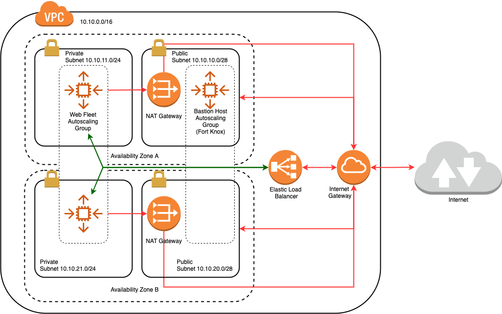

# Zero Downtime Web Server with Blue-Green Deployment

* Heavily adapted from <https://github.com/cepxuo/Terraform-AWS>.

* The AWS infrastructure consists of the following:

  
  The red arrows show traffic from/to Internet. The green arrows show traffic within VPC.

  * VPC
  * Subnets
  * Internet gateway
  * NAT gateways with Elastic IPs
  * Routes
  * Security group
  * Launch configuration
  * Autoscaling group
  * Load balancer
